#The Mobify CS Design Team Photoshop Handbook

This document is meant to guide designers in how to structure and maintain their photoshop documents. Consider this your handbook to our best practices, tips and tricks, and organizational structure for Photoshop. Sticking to these guidelines will help communication between individual designers as well as developers during the design & engineering phases of a project.

*Developed with love by the [Mobify Design Team](http://mobify.com/)*

## Content
For the love of god, use REAL content wherever possible. Our clients have content we can use, so do so. Using real content will help you understand:

- interface gaps
- truncation issues
- problematic large chunks
- missing content
- extraneous content
- and a whole lot more

You have no excuse now. Go forth and use REAL CONTENT!

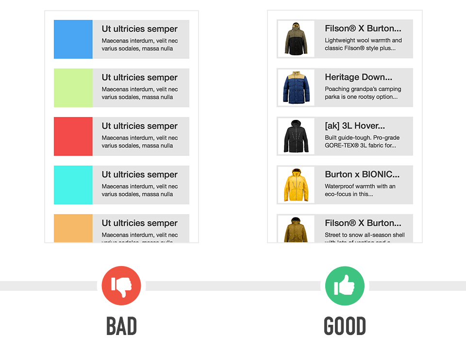

## Setup for Retina Mockups

Mockups should be created a 2× resolution by default. This can make thinking in consistent units hard (2px in PSD == 1px in CSS). The recommended way to ease this pain is to set up Photoshop documents to use `pt` units, as follows:

1. When creating a new document, set the Resolution to 144px/inch. If updating an existing document, do this in _Image > Image Size_ (make sure Resample is disabled).

2. Open _Photoshop > Preferences > Units and Rulers_.
    1. In the Units fieldset, change both Rulers and Type to Points.
    2. In the New Document Preset Resolutions fieldset, change the Screen Resolution to 144px/inch.

3. In _Photoshop > Preferences > Guides, Grid and Slices_, **Make sure** to leave the Gridline and Subdivision settings in **pixel** units, not points. Using point for snapping is buggy and will lead to errors. Example: if you want gridlines every 8 points, set this value to 16 pixels.

Note: some palettes and inputs (such as Transform) do not respect the unit preferences. However, they do remember the last unit used so as you work in points they will come to reflect the new preferred unit.

## Modules & Linked Smart Objects

Photoshop CC now supports linked smart objects. Following in the footsteps of InDesign and Illustrator, users can now drop linked files into Photoshop documents. When a linked smart object has been placed in a PSD, Photoshop will detect changes to this linked file and you can update them as needed across all PSD's. This allows us to modularize our elements in a similar fashion to the way our CSS has been modularized.

Please break up your PSD's into logical modules and place these modules as linked smart objects in your PSD's. Here's how to place a linked smart object:

_File > Place Linked_

I've put together this diagram to help:

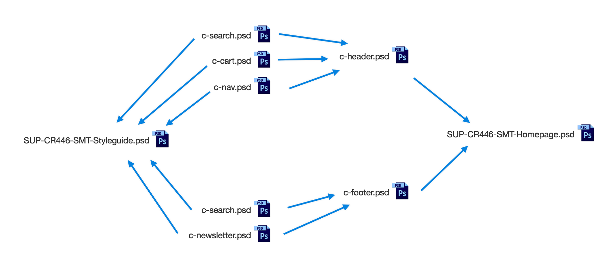

As far as naming conventions go, for the modular PSD's we'll be following in the same footsteps as the CSS Style Guide and its reference to Component Oriented Naming, and for the non-modular PSD's we'll follow our standard file naming and folder conventions . So click the links and study up.

_This system can get unruly and complicated pretty easily, but its a HUGE help on massive projects with lots of comps. If you're working on a quick small project, you don't HAVE to use this structure, its probably overkill._

You'll also notice the above diagram has a styleguide.psd. This segues nicely into our next topic:

## Styleguide.psd
Every project should have its own styleguide.psd file that contains all the elements of a projects interface. This style guide can they be used by developers to create the necessary CSS markup for interface elements, without having to hunt through an entire project's worth of mocks.

As identified by the diagram above, the style guide should actually consist of components that are linked smart objects. This allows us to maintain that the compontent.psd file is the master copy and that updates to it propagate through all their linked PSDs.

Find the template on BOX:
_Design Team > Assets (General) > UI Style Guide Template > style-guide-template.psd_

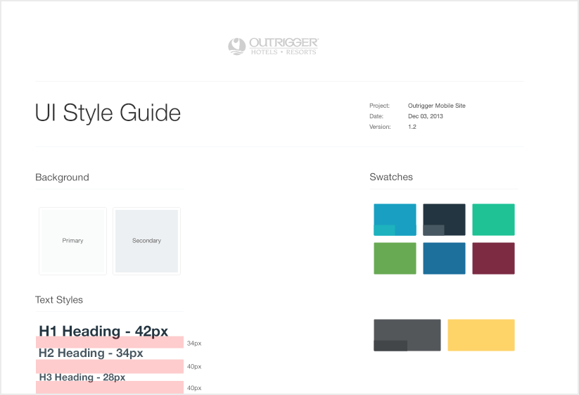

## Layer Panel Options
We've also got some great suggested layer panel options for you: 

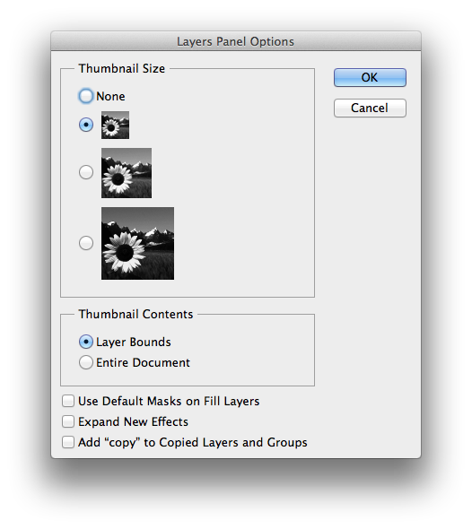

- Thumbnail Contents: Layer Bounds
- uncheck “Expand New Effects”
- uncheck “Add “copy” to Copied Layers and Groups”

## Layer Naming
One of the most fundamental rules of Photoshop etiquette is to name your layers. Please name all layers and groups with descriptive names, even if its something like “left arrow”, it helps. There is nothing worse than coming across a group of layers titled “rectangle copy 4”, “rectangle copy 5”, etc. That tells me NOTHING!

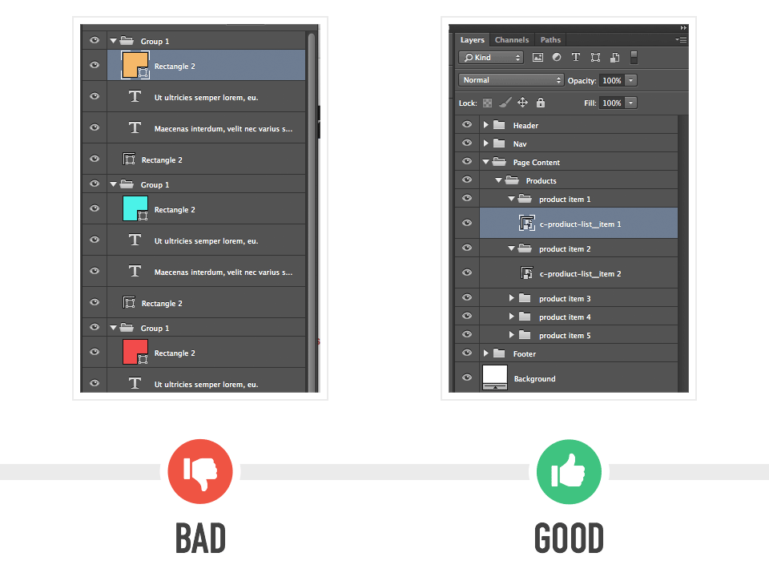

## Framer.js
to be added at a later date

## Fonts & Web Typography
Fancy fonts impress clients. When using non web standard fonts in your Photoshop comps, make sure you copy the font file to the “assets” folder. Check our file-naming and folder conventions for where exactly these assets should exist. Also, make sure you've devised a way to deliver those fancy web fonts. Talk to your project engineer to figure out a way to serve font files, whether thats through a hosted solution, or delivering the files ourselves. Take a peek at the following services:

- [Google Fonts](http://www.google.com/fonts)
- [Typekit](https://typekit.com/)
- [cloud.typography](http://www.typography.com/)
- [Fonts.com](http://www.fonts.com/web-fonts)

At this time we don't have a Mobify account for these, so you have a few options:

1. **Use Own Account - **login and use fonts using your own account
1. **Use Client Account - **check to see if the client has an account and use theirs

Also, drop into the Design Chat room on Hipchat to check to see if any other designers on the team have worked with the particular font you're looking to use. Perhaps they have the file locally, or maybe they know the best service to serve it.

## Icons

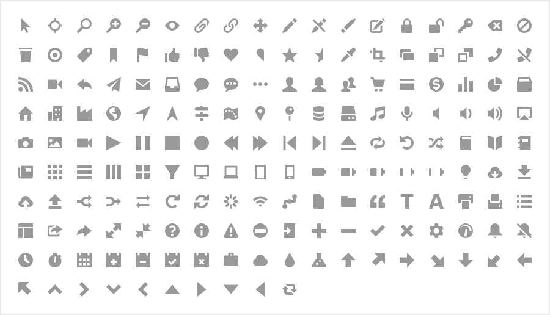

Using iconography in your mocks is highly encouraged. Make sure your referencing the icon file, and that you’ve included the font in the assets folder. Check our file-naming and folder conventions for where exactly these assets should exist. Mobify has already purchased some icon fonts to speed up your icon design process. You can find the assets on BOX, or learn about them here:

- [Symbolset - SS Standard](https://symbolset.com/icons/standard)
- [Symbolset - SS Social](http://symbolset.com/icons/social-regular)
- [Pictos 1](http://pictos.cc/one/)
- [Pictos 2](http://pictos.cc/two/)
- [Iconsweets Deluxe](http://iconsweets2.com/)
- [Font Awesome](http://fortawesome.github.io/Font-Awesome/)
- and more...

### Icon Subsetting
Icon subsetting is the practice of removing unused characters in a font family to reduce its file size and increase load time. We've seen font files go from 40kbs to 6kbs, which makes sense right? Why serve 100+ social media icons when you're only using FB and Twitter? There are some great services out there that will help you subset your icon fonts:

- [Fontello](http://fontello.com/)
- [Fontastic](http://fontastic.me/)
- [Icomoon](http://icomoon.io/)

Fontastic seems to have some great collaboration tools, so you dont have to upload/download files everytime you work on the icons.

## Paragraph & Character Styles

### A - Margins
Rather than dealing with new type layers, and soft carriage returns, try to setup your typography system using the paragraph and character panels. The Paragraph spacing options allow you to add space before and after paragraphs, super handy for blocks of text!

### B - Letter Spacing
Try not to use it, but if you must use increments of 50. Increments of 50 generally translates to 1px + or - but this scales with the font size, so use your judgement.

### C - Hyphenation
Since CSS doesn't support hyphenation, make sure hyphenation is turned off in Photoshop as well. Check the Paragraph panel.

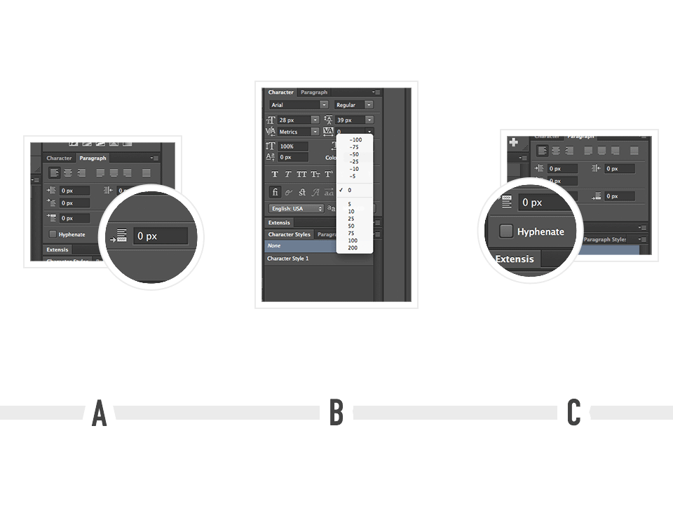

## Masking
Mask once! Since Photoshop supports group masks, just apply your mask to the parent group instead of to the 10 layers inside of it. Also, try to get in the habit of building your masks with vectors. Vector masks increase the versatility, and extensibility of masks and also speeds up the file.

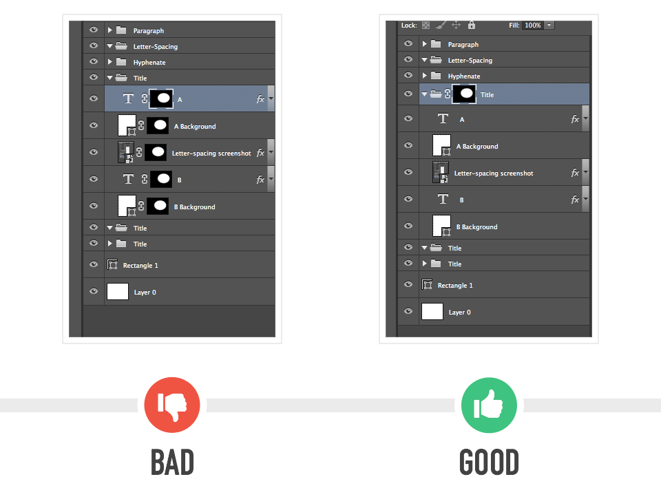

## Vector Shapes
Use vector shapes whenever possible. Photoshop CC now supports native non-destructive transform on all vector shapes. So if you make sure you’re building rounded rectangles with the rounded rectangle tool you can now adjust those rounded corners in the path panel, even after transforming the rectangle. Finally, Illustrator like vector tools, HOORAH!

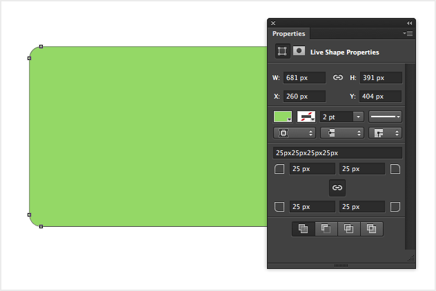

## Paths
When working with paths make sure you save them. There is nothing worse than spending hours making the perfect clipping mask only to close the file and loose the path. Save that shit.

## Image Embedding
We all love embedding our clients sweet photos into image carousels (they send over the best photography!) When you do, make sure the image is embedded at 100% height and 100% width and turn that image into a smart object. Now when you resize to fit, you’ll be doing so non-destructively. Smart Objects FTW.

## Colour Profiles
Make sure you disable colour management in Photoshop. We want our mocks to be easy for developers, and since there are no colour management options in development, we gotta scrap 'em in Photoshop too. To do this:

_Edit > Color Settings_

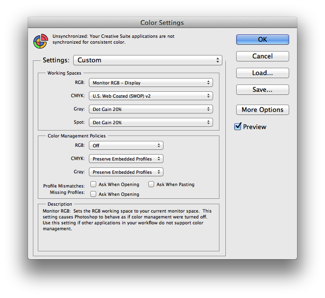

## Colour Swatches
When working on a client project, make sure to check the assets folder for a colour swatches panel. Every project should have one, and if it doesn’t please create one. Couple things to note here:

- name colours using our scss naming syntax
- use the swatches present manager to easily manage colour swatches
- large list view is great for a list of colours and their titles

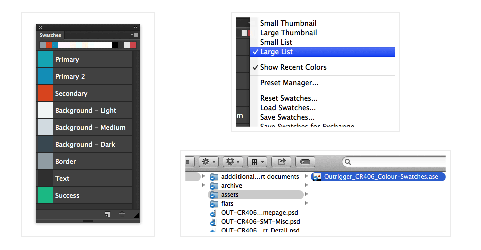

## Sharp Edges
Make sure your snap to pixels and grid tools are enabled. We want those pixels to be as sharp as possible, nobody likes soft blurry edges.

## Export Assets
Use Photoshop's "Save for Web" panel when exporting image assets. Make sure:

- "convert to sRGB" is unchecked
- preview select is set to "Monitor Colour"

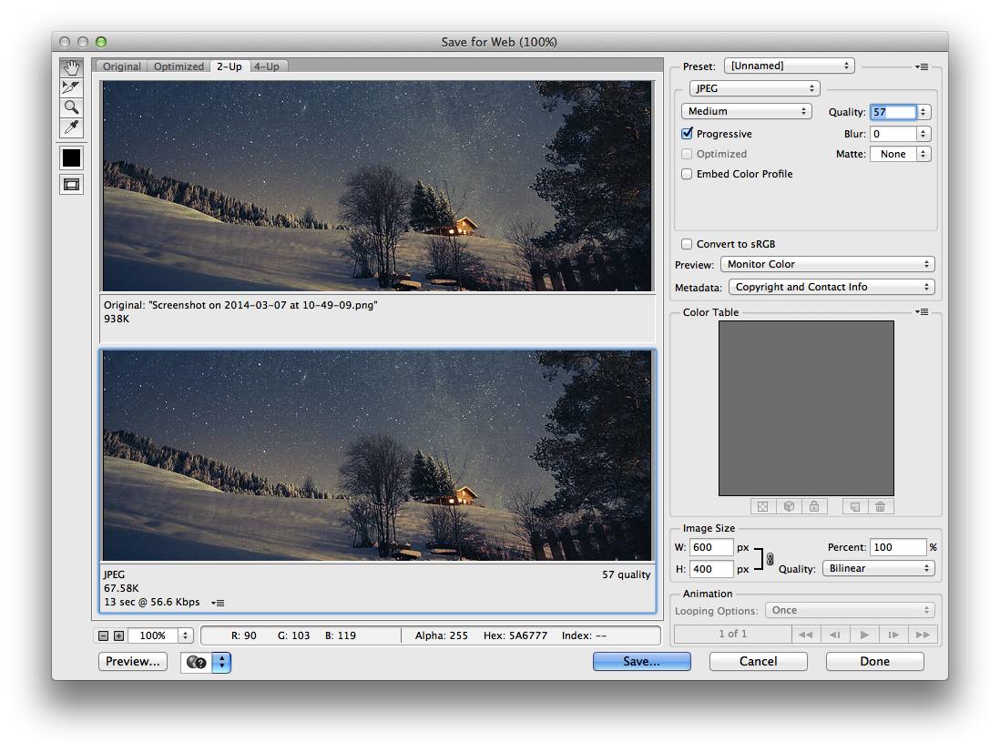

## Layer Comps
Layer Comps should be used to create states for interaction patterns. Layer Comps should not be used to create new pages. Composer is a great Photoshop plugin that makes working with Layer Comps a thousand times better. Check it out here: http://www.jasonforal.com/composer/

## Action States
When developing action states for interaction patterns, make sure you label and organizers your layers appropriately designate the state after the layer. Something like:

- Home Button - Hover
- Home Button - Down

Feel free to build out layer comps for larger state changes

## Plugins
We use a few plugins to increase efficiency and improve our workflows. They are:

- [GuideGuide](http://guideguide.me/) - pixel accurate columns, rows, midpoints, and baselines can be created based on your document or selection with the click of a button
- [Composer](http://www.jasonforal.com/composer/) - Update multiple layer comps in Photoshop with just one click
- [CSS Hat](http://csshat.com/) - turns Photoshop layer styles to CSS3. Magic.
- [Subtle Patterns](http://plugin.subtlepatterns.com/) - easy access to Subtle Patterns massive pattern library
- [Remove Unused FX](https://github.com/Moyidu/Remove-Unused-FX) - easily remove disabled and unused layer effects
